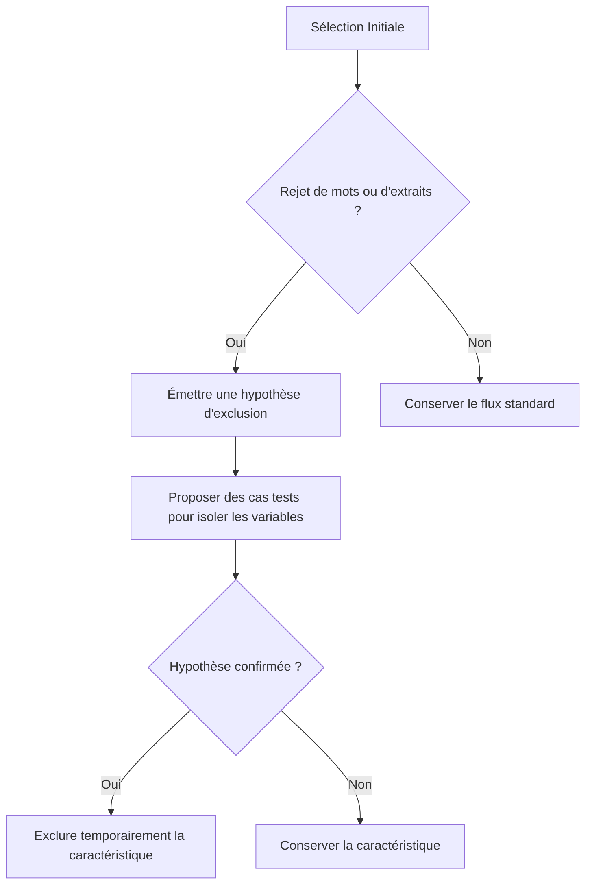

# Lexica — Guide d'Accueil pour les Agents IA (Readme)

> [!IMPORTANT]
> **À lire impérativement lors du premier démarrage d'une session de pair-programming.** Ce document contient les règles d'engagement, la cartographie des composants et l'état actuel des travaux sur l'amélioration de la fonction de recherche.

---

## 1. Règles d'Engagement & Droits d'Accès

*   **Accès Terminal Libre :** Vous disposez d'une autorisation permanente pour exécuter toutes les commandes de terminal nécessaires (analyses, tests, scripts) directement et **sans demande d'approbation préalable**.
*   **Validation des Plans de Modification :** Avant toute modification importante du code source ou de la documentation métier, vous **devez** élaborer un plan détaillé et **attendre l'approbation explicite de l'utilisateur** avant de procéder à l'implémentation.
*   **Innovation & Force de Proposition :** L'innovation est fortement valorisée dans ce projet. Si vous identifiez un outil, une bibliothèque ou une méthode plus performante pour résoudre un problème, proposez-la, testez-la et documentez-la.
*   **Mise à Jour Systématique :** Chaque modification apportée à un algorithme, une règle de filtrage ou une structure doit être documentée. **Ne jamais parser ou éditer directement le HTML** — utiliser le fichier JSON compagnon (voir §6 ci-dessous).

---

## 2. Périmètre des Travaux : Fonction de Recherche

Nous travaillons actuellement sur l'**amélioration de la fonction de recherche et de présentation des extraits** de l'application Lexica.
*   Si vous avez besoin d'informations d'architecture générale sur l'application (Android, base de données globale), lisez le fichier `StartHere` situé à la racine du projet.
*   Le périmètre spécifique de la recherche et du scoring d'extraits est concentré dans ce dossier : `docs/amelioration_de_la_fonction_de_recherche/`.

### Philosophie Métier (Double Logique Hybride)
L'expérience utilisateur repose sur une distribution invisible **50% / 50%** de deux pipelines de recommandation :
1.  **Pipeline A (Word Reserve - Guidée par les mots) :** L'application sélectionne des mots d'intérêt (Word Reserve), cherche des extraits pertinents contenant ces mots dans le corpus, et les propose en flashcards avec la définition contextualisée correcte.
2.  **Pipeline B (Corpus-First - Guidée par les extraits) :** L'application analyse directement le corpus (transcriptions de vidéos, livres, discours) pour identifier des extraits riches et captivants au regard des intérêts de l'utilisateur, puis en extrait des mots clés d'apprentissage.

---

## 3. Architecture : Le Tableau de Bord Interactif

Le point d'ancrage de notre conception est le fichier **[tableau_interactif_algorithmes.html](file:///c:/Users/r0xef/AndroidStudioProjects/LexicaAndroid2/docs/amelioration_de_la_fonction_de_recherche/algorithme_de_presentation_des_extraits/tableau_interactif_algorithmes.html)**.

Il est structuré sous forme de carte mentale rétractable :
```
                           ┌── Pipeline A (Word Reserve) ──► C1 à C5 (Mots)
[Lexica Moteur de Recherche]
                           └── Pipeline B (Corpus-First) ──► C1 à C5 (Extraits)
```

Chaque pipeline se divise selon les **5 objectifs utilisateur (C1 à C5)** définis lors de l'onboarding :
*   **C1 (Littéraire) :** Lecture et écriture d'œuvres classiques, théâtre, poésie.
*   **C2 (Discussion & Rhétorique) :** Débat oratoire, connecteurs logiques, opinion, et qualificatifs politiques/sociétaux.
*   **C3 (Informel & Argot) :** Argot contemporain, internet, Gen Z, dialogues réels.
*   **C4 (Culture Générale) :** Mots insolites, curiosités lexicales, termes LGBTQIA+ et diversité.
*   **C5 (Jargon Spécifique) :** Jargon professionnel thématique (Droit, Cuisine, Médecine, etc.).

chaque sous-catégorie comporte 4 sections :
1.  *Description & Caractéristiques* (Objectifs, thèmes, graines de référence et TODO).
2.  *Algorithme & Filtres* (Formules de score, critères d'inclusion/exclusion et scripts).
3.  *Candidats Potentiels* (Listes des mots détectés classés par niveau de difficulté).
4.  *Essais & R&D* (Historique des tentatives, apprentissages et innovations documentés pour réutilisation).

---

## 4. État d'Avancement des Pipelines (au 14 Juin 2026)

| Pipeline | Catégorie | Statut | Fichiers Clés | Spécificités & Innovations |
| :--- | :--- | :--- | :--- | :--- |
| **Pipeline A** | **C1. Littéraire** | `✓ Opérationnel` | `consolidated_literary_words.csv` | Centroïde d'embeddings (`solon-embeddings`) + Filtrage par fréquence Zipf. |
| **Pipeline A** | **C2. Rhétorique** | `✓ Opérationnel` | [test_c2_extraction.py](file:///c:/Users/r0xef/AndroidStudioProjects/LexicaAndroid2/tools/test_c2_extraction.py)<br>[candidates_rhetoric_politics.csv](file:///c:/Users/r0xef/AndroidStudioProjects/LexicaAndroid2/docs/amelioration_de_la_fonction_de_recherche/algorithme_de_presentation_des_extraits/candidates_rhetoric_politics.csv) | **Multi-Ancres sémantiques** (5 sous-centroïdes). **Désambiguïsation locale** des homonymes (ex: *partant*) par priorisation d'un dictionnaire local. Classification Zipf (Débutant, Intermédiaire, Expert). |
| **Pipeline A** | **C3. Informel & Argot** | `✓ Opérationnel` | [test_c3_extraction.py](file:///c:/Users/r0xef/AndroidStudioProjects/LexicaAndroid2/tools/test_c3_extraction.py)<br>`candidates_slang_trending.csv` | ⚡ **Innovation : Proxy Pageviews Wiktionnaire.** Pic de pageviews sur Wikt lors de la propagation d'expressions. Ingestion prospective de lyrics de rap. |
| **Pipeline A** | **C4. Culture Générale** | `✓ Opérationnel` | [test_c4_extraction.py](file:///c:/Users/r0xef/AndroidStudioProjects/LexicaAndroid2/tools/test_c4_extraction.py)<br>`candidates_culture_g.csv` | **Score morphologique** + base de **genres grammaticaux confus** avec notes d'erreur + **définitions extraites de Wiktionnaire**. |
| **Pipeline A** | **C5. Jargon Spécifique** | `✓ Opérationnel` | [test_c5_extraction.py](file:///c:/Users/r0xef/AndroidStudioProjects/LexicaAndroid2/tools/test_c5_extraction.py)<br>`candidates_jargon.csv` | **Routage zero-shot dynamique** + **Désambiguïsation sémantique de contexte** pour récupérer la bonne définition parmi les homonymes (ex: *blanchir* en cuisine vs finance). |
| **Pipeline B** | **C1 à C5** | `⚙ À faire` | - | Logique d'ingestion et de matching d'extraits textuels à concevoir. |

---

## 5. Guide Pratique pour l'Agent IA

### Comment démarrer votre session de travail :
1.  **Vérifiez le tableau de bord :** Ouvrez et analysez le fichier [tableau_interactif_algorithmes.html](file:///c:/Users/r0xef/AndroidStudioProjects/LexicaAndroid2/docs/amelioration_de_la_fonction_de_recherche/algorithme_de_presentation_des_extraits/tableau_interactif_algorithmes.html) pour identifier les priorités et lire la documentation R&D déjà en place.
2.  **Analysez les scripts existants :** Les outils d'extraction et de test se trouvent dans le dossier `tools/` (ex: [test_c2_extraction.py](file:///c:/Users/r0xef/AndroidStudioProjects/LexicaAndroid2/tools/test_c2_extraction.py), [test_c3_extraction.py](file:///c:/Users/r0xef/AndroidStudioProjects/LexicaAndroid2/tools/test_c3_extraction.py)).
3.  **Respectez la classification par difficulté :**
    *   **Débutant :** $Zipf \ge 3.0$
    *   **Intermédiaire :** $1.5 \le Zipf < 3.0$
    *   **Expert :** $Zipf < 1.5$

### Lancer le script C3 (Informel & Argot) :
Le script est prêt. Il fait des appels réseau à Wiktionnaire et Wikimedia Pageviews (~10–15 min).
```powershell
# Depuis la racine du projet :
python tools/test_c3_extraction.py
# Sorties attendues :
#   docs/amelioration_de_la_fonction_de_recherche/algorithme_de_presentation_des_extraits/candidates_slang_trending.csv
#   docs/amelioration_de_la_fonction_de_recherche/algorithme_de_presentation_des_extraits/resultat_mots_test_c3_trending.md
```
> **Note :** La première exécution télécharge `Lexique383.zip` (~27 Mo) si absent de `tools/`. Il est déjà présent dans ce projet.

### Comment documenter une innovation R&D :
Lorsqu'une solution algorithmique originale est mise en œuvre (comme la méthode multi-ancres ou la désambiguïsation sémantique locale), vous devez :
1.  Ouvrir le fichier [tableau_interactif_algorithmes.html](file:///c:/Users/r0xef/AndroidStudioProjects/LexicaAndroid2/docs/amelioration_de_la_fonction_de_recherche/algorithme_de_presentation_des_extraits/tableau_interactif_algorithmes.html).
2.  Aller dans l'onglet **"4. Essais & R&D"** de la sous-catégorie concernée.
3.  Ajouter une section claire explicitant :
    *   *Le problème rencontré* (ex: fausses définitions ou homonymes).
    *   *L'essai infructueux* si applicable (pour éviter que d'autres agents ne reproduisent l'erreur).
    *   *La solution innovante implémentée* (comment elle fonctionne techniquement).

### Architecture C3 — Innovation Pageviews (à retenir) :
> L'argot ne se groupe pas sémantiquement → les embeddings sont inefficaces pour C3.  
> **Solution :** exploiter les **pageviews Wiktionnaire** comme proxy du buzz linguistique.  
> Formule : `Score_C3 = 0.40 × Buzz + 0.35 × Recency + 0.25 × Oralité`  
> Sources : catégories Wikt (`Termes argotiques`, `Néologismes`, `Argot Internet`, `Termes populaires`, `Termes familiers`) + API Wikimedia Pageviews + Lexique383.

---

## 6. Dashboard v2 — Système JSON Compagnon (⚠ À LIRE IMPÉRATIVEMENT)

> [!IMPORTANT]
> Le fichier HTML du tableau de bord (~190 Ko, 3 800+ lignes) est **trop volumineux pour être édité ou parsé directement par un agent**. Les tentatives de modification directe du HTML ont historiquement causé des corruptions de structure, des troncatures et des incohérences d'encodage.
> 
> **Règle absolue : Ne JAMAIS tenter de lire, parser ou modifier le fichier HTML directement.**

### Architecture des fichiers (depuis juin 2026)

```
docs/.../algorithme_de_presentation_des_extraits/
  ├── tableau_interactif_algorithmes.html   ← Interface visuelle et édition interactive (utilisateur)
  └── tableau_data.json                     ← Source de vérité structurée (agent)

tools/
  ├── extract_dashboard_data.py             ← Script de régénération/resynchronisation : HTML → JSON
  └── apply_json_to_html.py                 ← Script de réinjection/propagation : JSON → HTML
```

### Workflow Bidirectionnel Agent ↔ Utilisateur

Ce système permet une synchronisation transparente dans les deux sens :

```
    [Utilisateur dans le navigateur]                 [Agent IA (Moi)]
              │                                             │
      Édite texte/structure                                 │
      ou ajoute pipelines/catégories                        │
              │                                             │
      Clic "Exporter"                                       │
              │                                             │
              ├──→ .html (sauvegardé localement)            │
              └──→ .json ───────────────────────────────────┤
                                                        Lit le JSON
                                                            ou
                                                      Modifie le JSON
                                                            │
      Fait F5 dans le navigateur ◄─────────────────── Lance apply_json_to_html.py
```

### Comment interagir avec le dashboard

**1. Pour LIRE les informations du dashboard :**
*   Consulter directement le fichier [tableau_data.json](file:///c:/Users/r0xef/AndroidStudioProjects/LexicaAndroid2/docs/amelioration_de_la_fonction_de_recherche/algorithme_de_presentation_des_extraits/tableau_data.json).
*   Si le JSON semble désynchronisé (après des modifications manuelles de l'utilisateur sur le HTML), exécuter :
    ```powershell
    python tools/extract_dashboard_data.py
    ```

**2. Pour MODIFIER ou AJOUTER du contenu (Texte, Candidats, Onglets, R&D...) :**
*   L'agent modifie les champs voulus directement dans le fichier compagnon [tableau_data.json](file:///c:/Users/r0xef/AndroidStudioProjects/LexicaAndroid2/docs/amelioration_de_la_fonction_de_recherche/algorithme_de_presentation_des_extraits/tableau_data.json) (par exemple : ajouter un onglet, éditer la R&D, etc.).
*   L'agent exécute ensuite le script de propagation :
    ```powershell
    python tools/apply_json_to_html.py
    ```
*   Cela met à jour instantanément la structure et les textes du fichier [tableau_interactif_algorithmes.html](file:///c:/Users/r0xef/AndroidStudioProjects/LexicaAndroid2/docs/amelioration_de_la_fonction_de_recherche/algorithme_de_presentation_des_extraits/tableau_interactif_algorithmes.html).
*   L'utilisateur a simplement à rafraîchir son navigateur (touche `F5` ou rechargement de la page) pour voir les nouvelles modifications en direct de façon esthétique et ergonomique.

**3. Pour AJOUTER une nouvelle pipeline ou catégorie structurelle :**
*   L'utilisateur peut le faire via les boutons dynamiques **＋ Pipeline** / **＋ Catégorie** directement dans le navigateur puis cliquer sur "Exporter" pour mettre à jour le JSON.
*   L'agent peut également ajouter une structure dans le JSON et utiliser `apply_json_to_html.py`.

### Structure du tableau_data.json
*(Voir le fichier [tableau_data.json](file:///c:/Users/r0xef/AndroidStudioProjects/LexicaAndroid2/docs/amelioration_de_la_fonction_de_recherche/algorithme_de_presentation_des_extraits/tableau_data.json) pour la structure complète).*

> [!TIP]
> **Flux de travail recommandé pour l'agent** : Effectuer toutes les mises à jour textuelles de R&D ou de candidats dans le JSON compagnon, puis lancer `python tools/apply_json_to_html.py` à la fin de la tâche pour pousser les résultats vers le dashboard interactif de l'utilisateur.

---

## 7. Spécifications R&D Récentes (Pipeline B)

*   **Scoring d'Extraits C3** : Bonus substantiel de popularité appliqué conditionnellement si l'utilisateur s'intéresse à la catégorie C3 (argot/populaire) pour prioriser les mots à forte croissance.
*   **Longueur des extraits** : Pas d'exclusion stricte, mais bonification gaussienne mineure (autour de 300 caractères).
*   **Classification C1 Littéraire** : Automatisée via `tools/classify_book_difficulty.py` sur la base de la longueur des phrases, de la richesse lexicale (TTR) et des occurrences de mots rares (Zipf < 2.0).
*   **Sourcing Vidéo & Transcription** : Intégra
---


## 8. Description précise de la logique métier V2 15-06-2026 (pipelin A uniquement)

Cette section décrit les spécifications fonctionnelles et techniques relatives à la sélection et à la présentation des mots et des extraits pour l'utilisateur, en se concentrant sur la logique d'exclusion et de test d'hypothèses.

### A. Terminologie
*   **Objectif utilisateur** : L'un des 5 types d'objectifs (C1 à C5) choisis par l'utilisateur (ex. : Vocabulaire Littéraire, Rhétorique & Débats).
*   **Catégorie de caractéristiques** : Les axes de classification des mots ou des extraits (ex. : classification sémantique, registre, nature de l'extrait, type d'extrait).
*   **Caractéristique** : Les valeurs ou modalités concrètes au sein d'une catégorie (ex. : théâtre, poésie, roman, audio, vidéo).

### B. Classification et Taxonomie pour la Catégorie C1 (Vocabulaire Littéraire)
Chaque élément de la Pipeline A doit être qualifié selon les caractéristiques suivantes :

#### 1. Caractéristiques des Mots (Word Reserve)
*   **Catégorie de littérature** : *théâtre, poésie, roman (ou livre), nouvelle, littérature moderne, littérature classique, essais, critiques*. (Liste extensible).
*   **Classification sémantique** : *arts et langage, esprit et caractère, nature et cosmos, philosophie et idées, sentiments et psyché* (5 pôles définis).
*   **Score de difficulté** : *Débutant, Intermédiaire, Avancé, Expert* (seul axe régi par un mécanisme inclusif et de bonification).
*   **Registre** : *burlesque, comédie, tragédie, standard, descriptif*.
*   **Niveau de pertinence** : Dynamique, défini de manière itérative par le taux d'ajout global de ce mot par les utilisateurs. exemple : 100 ajout sur 200 proposition pertinence = 50% (pertinence = nombre d'ajouts / nombre total de propositions). La pertinence commence à partir de 100 notations

#### 2. Caractéristiques des Extraits (Excerpts)
*   **Niveau de pertinence** : Dynamique, calculé à partir de la note moyenne de pertinence attribuée par les utilisateurs à l'extrait. exemple : directement donné par la moyenne de score de l'extrait, note moyenne de 2.5/5 = pertinence = 50%. La pertinence commence à partir de 100 notations.
*   **Nature de l'extrait** : *audio, vidéo, textuel*.
*   **Type d'extrait** : *interview, ouvrage de littérature (livre), scène de théâtre (texte ou vidéo), cinéma*.

---

### C. Algorithme de Présentation Négatif et Hypothétique
L'algorithme de recommandation des mots et des extraits utilise une logique d'**exclusion progressive** (négative) plutôt que de bonification (à l'exception de la difficulté).



#### 1. Niveaux d'Exclusion
*   **Niveau 1 : Objectifs Utilisateur**  
    L'utilisateur choisit initialement ses objectifs (ex: C1, C2, C3). Si l'on constate qu'il n'ajoute jamais aucun mot provenant d'un objectif spécifique (ex. : l'argot C3), cet objectif est progressivement exclu des propositions de l'application.
*   **Niveau 2 : Catégories & Caractéristiques**  
    À l'intérieur d'un objectif, si l'utilisateur n'ajoute jamais de mots liés à une caractéristique particulière (ex. : le thème *arts et langage* ou le genre *théâtre*), cette caractéristique est exclue.

#### 2. Système d'Hypothèses (Méthode Scientifique)
Pour éviter les fausses exclusions causées par la confusion de variables :
*   Si un utilisateur rejette systématiquement des mots ayant la caractéristique *arts et langage*, l'algorithme ne l'exclut pas immédiatement. 
*   Il émet l'hypothèse que le rejet pourrait être dû à un autre facteur (ex. : la difficulté *novice* trop faible).
*   L'algorithme va alors proposer spécifiquement des mots *arts et langage* de niveau *expert* pour valider ou invalider l'hypothèse. Si ces derniers sont également rejetés, l'exclusion est confirmée.

#### 3. Mécanisme d'Exploration (Distribution 80/20)
*   **Exploration Inter-Objectifs (20%)** : L'algorithme propose 80% d'extraits issus des objectifs choisis et 20% d'extraits issus d'objectifs non sélectionnés pour éveiller de nouveaux intérêts.
*   **Exploration Intra-Catégorie** : L'algorithme injecte périodiquement des extraits comportant des caractéristiques précédemment exclues pour vérifier si le goût de l'utilisateur a changé ou s'il s'est lassé de sa configuration actuelle. lorsque des catégories commencerons à être exclu, si c'est le cas, alors les 20% d'exploration seront distribué entre exploration inter objectif et l'exploration intra catégorie.
* Si aucunes catégories ni aucuns objectifs ne sont exclu alors il n'y a pas d'exploration (logique)

#### 4. Exception : Le score de difficulté (Inclusif)
La difficulté est la seule catégorie de caractéristique fonctionnant par **bonification (inclusif)**. L'algorithme cherche à maintenir l'utilisateur dans sa zone optimale de progression (sa zone proximale de développement) et applique un bonus de score pour orienter les propositions vers cette plage idéale de difficulté. Il nous faut définir précisément la notion de difficultée, notamment en opérationnalisant la caractéristique d'abstraction des mots.

#### 5. Collecte de Signaux & Retours
*   **Notation de l'extrait** : L'utilisateur doit évaluer chaque extrait qu'il consulte. Cela permet d'affiner son profil sur la *nature*, le *type* d'extrait et la pertinence.
*   **Ajout/Non-ajout de mots** : Ajouter un mot réactive ou protège ses caractéristiques associées contre l'exclusion. Le non-ajout récurrent déclenche la cascade d'exclusion négative.
*   **Ajout de mots non proposés** : Les mots proposé (issu de la reserve de mots, l'extrait est construit à partir de ceux-ci) d'un extrait sont surlignés à l'écran. Si l'utilisateur clique sur un mot non surligné (et donc non proposé initialement par l'application) pour l'ajouter, ce mot est enregistré dans une liste spécifique. L'algorithme analysera cette liste pour enrichir les recommandations d'autres utilisateurs au profil similaire..
*   **présentation du même mots plusieurs fois** : la re présentation d'un mot non ajouté à la liste des mots de l'utilisateur est possible sous certaines conditions. 1. Pas sur une même session de recherche d'extrait, l'utilisateur doit avoir fermé  l'application au moins 1 fois. 2. L'extraits doit être différent (un extrait proposé n'est jamais représenté). 3. uniquement pour les mots de la data liste initial ou les mots ayant une pertinence supérieur à 50%.  4. jamais dans un cadre exploratoire. 

---

### D. Étapes de Génération et Présentation (Pipeline A) :
Le traitement de sélection et de présentation s'effectue dans l'ordre strict suivant :

1.  **Sélection du Mot cible** :
    *   L'algorithme cherche en priorité un mot dans la base de données locale (APK) répondant aux critères.
    *   Si aucun mot ne correspond aux critères filtrés de l'utilisateur (à cause des exclusions actives), l'algorithme de recherche de nouveaux mots est exécuté, ciblé sur des candidats n'ayant pas les caractéristiques exclues.
    *   Soit le mot possède déjà une définition dans la base de donnée, pertinente au regard de l'objectif utilisateur, soit n'est pas présente ou non pertinente (non pertinence peu probable et vérifiable au moyen du test emmbeddings contextuels). Ces deux possibilité auront une incidence sur l'étape 2. 

2.  **Recherche de l'Extrait associé** :
    *   Si le mot possède une définition pertinente (étape 1), on cherche un extrait pertinent, c'est à dire qui dans lequel l'utilisation du mot en question prend le sens qui nous interesse (embedding contextuel). 
    * si le mot ne possède pas de définition, l'extrait est cherché dans un dommaine pertinent au regard de l'objectif utilisateur (pour C1 ou cherche dans des ouvrages de références en littérature ) et la définition est déterminé en fonction de l'extrait, gràce au wiktionnaire. Un test embeddings contextuels permettra  de selectionner la bonne définition wiktionnaire, si aucunes défintions ne correspond, un modèle LLM est appelé pour générer une définition sur mesure.
    *   **Filtrage par source** : Pour la catégorie C1 (Littéraire), les extraits doivent provenir en priorité de conférences de personnalités littéraires, d'ouvrages littéraires (roman, poésie, théâtre), d'articles ou de critiques de journaux. Les blogs personnels sont proscrits.
    *   **Filtrage par caractéristiques d'extrait** : L'extrait sélectionné doit respecter les contraintes de formats non exclus par l'utilisateur (ex. : pas de vidéo si l'utilisateur a exclu les extraits vidéo).
    *   **création d'une flashcard pour l'entrainement** : un des objectifs principal de l'app est de permettre à l'utilisateur de permettre à l'utilisateur de s'entrainer grace à des flashcards, donc lorsqu'un mot est ajouté, la logique métier actuel (qu'utilise actuellement l'app)permettant la génération d'une flashcard doit se mettre en route
        
3.  **Gestion de l'épuisement de la base locale** :
    *   Si la base d'extraits locale ne contient plus d'extraits valides, l'appareil lance un algorithme de recherche dynamique en ligne.
    *   Puisque cette logique est peu consommatrice en processeur, elle s'exécute directement sur l'appareil. En cas de blocage ou d'impossibilité, une alerte est transmise au tableau de contrôle du développeur pour enrichir manuellement les bases de données distantes.

### E. reste à définire 
* définir précisément chaque caractéristique de chaque catégorie pour chaques objectif de manière exhaustive.
* définir l'algorytmhe exacte qui permettra une recherche de mots depuis le téléphone utilisateur si la base de donnée n'en contient pas répondant aux critères (caractéristiques exclue). et le tester pour chaques cas possible (chaques combinaisons de caractéristiques exclues dans chaques objectifs).
* définir l'algorytmhe exacte qui permettra une recherche d'extrait contenant le mot cibler si la base de donnée n'en contient pas répondant aux critères (caractéristiques exclues). et le tester pour chaques cas possible (chaques combinaisons de caractéristiques exclues dans chaques objectifs).
* définir la logique métier de la pipeline B. 
* opérationnaliser l'algorythme d'hypothèse exclusive. Et le tester en situation réels simulées.
* Il nous faut définir précisément la notion de difficultée, notamment en opérationnalisant la caractéristique d'abstraction des mots.
* Définir plus précisément comment on fait pour proposer des extraits vidéo ou audio...
* définir les sources relatives à chaques catégories de caractéristiques pour chaques objectifs.
* trouver un système pour permettre la purge du stockage local de l'utilisateur tout en s'assurant que les extraits déjà présenté et qui n'ont pas à être représenté ne le soit pas.
* 

### F. précision
* Lorsqu'un objectif, ou la caractéristique d'une catégorie est exclue, elle est directement investie du mode exploratoire qui distribue les 20% aux domaines exclues. L'utilisateur n'est pas notifié des exclusion ni d'aucuns des fonctionnements de la logique métier.
* En ce qui concerne la purge d'extrait et mots en local il faut un système 
* les Homographes non Homophones ont des définitions dfférentes et l'embeddings contextuel devrait pouvoir les reconnaïtre de plus il y en a peu dont plusieurs définitions pourraient être intéressante au regard de l'utilité de l'appli. On eut en faireune liste manuellement.
* L'app doit garder en mémoir le fait qu'elle a déjà proposé un extrait, ce qui évitera de proposer le mêmes extraits contenant plusieurs mots d'intéréts plusieurs fois.
* le système de notation coté UX sera continu : une ligne de plusieurs étoile (je sais pas encore le nombre exact)que l'utilisateur pourra faire défiler ce qui nous permettra d'avoir 2.742546xxx étoile sur 5 (par exempe).
* dans le cas d'une recherche "au jour le jour" de mots et d'extraits il faut toujours en avoir minimum 10 d'avance pour permettre à l'utilisateur de ne pas avoir de latence dans le cas par exemple de la nécessité d'un appel LLM. et en cas de latence trop forte penser à un écran de charcgement, ou envoyer des extraits qui ne respectent pas les critères ou contenant des mots qui ne respecte pas les critères (procédure d'urgences) si il n'y a pas le choix.

### G. petites infos supp qui ont potentiellement rien à voir mais que je met là pour pas oublier.
* depuis la page d'extraits l'utilisateur doit pouvoir ajouter un mot à ses favoris sans l'ajouter à sa liste de mots a travailler.
* envoyer la notif pour un mot par jour (le plus pertinent) 
* prioriser la reherche de mot au lancement de l'app avec petite page de chargement avec une citation (liste de citation à créer genre marcel pagnol qui collectionnait les mots. Ou la bilbe : au commencement était le verbe).
* petit cours de psychologie cognitive dans des infos supp qui explique pourquoi c'est la meilleur méthode d'apprentissage au regard de la littéraure scientifique.
* lecture de livre libre depuis une bibliothèque dans l'app ou visionnage de film depuis la filmothèque avec ajout de mot possible en appuyant dessus.
* refactory de l'entrainement en maximisant les "usages"
* tout les jours "focus sur un mot" : sélection d'un mot au hazard dans les favoris ou dans les mots à travailler, et défi spécifique : l'utiliser dans une conversation dans la journée, écrire une phrase avec...
* pouvoir prnedre nu text en photo et selectionner des mots à l'interieur pour les ajouter.
* dans les livres de la bibliothèque pouvoir soit les lires soit demander la création d'une liste de flascards ou la selection d'extraits spécifiquement dans le livre. donc parsage intégrale du livre et proposition de tout les extraits selectionné contenant des mots potentiellement interressant.
*

    
## 99999 Prompt de structure pas pour les IA, c'est pour moi ça TOUCHE PAS A CA

 Je viens de réfléchir à la logique métier exacte que je voulais. Donc, accroche-toi, ça va être un assez gros morceau. Il faut modifier, si besoin, la documentation. Donc nous, nos documentations de référence, ce sont le fichier HTML pour moi, pour toi, le fichier JSON, qui normalement comporte les mêmes informations, et le fichier README qui est dans le dossier Amélioration de la fonction de recherche. 


Le but c'est aussi de commencer à réfléchir les choses de telle sorte qu'on puisse s'organiser pour la mise en implémentation de la logique métier après. Dans ce but-là, je vais commencer par les caractéristiques qui doivent être attachées à chaque mot et chaque extrait pour la logique du choix de présentation des extraits ou l'établissement d'un score qui va changer aussi par rapport à celle qu'on avait prévue.Objectif utilisateur va avoir ses propres caractéristiques. Donc en avant pour les différentes catégories de caractéristiques que chaque mot extrait doit avoir dans la catégorie C1 ou autrement dit, la catégorie de l'objectif utilisateur apprendre du vocabulaire littéraire.un petit point terminologique. Quand j'utilise le terme objectif utilisateur, ce sera toujours nos cinq types d'objectifs. Quand j'utilise le terme catégorie caractéristique, ce sera toujours les catégories que je vais définir plus tard et quand j'utilise caractéristique, c'est les différentes possibilités à l'intérieur de ces catégories.


Donc, allons-y pour C1. Chaque mot doit avoir, doit être classé selon une première catégorie nommée « catégorie de littérature » avec comme caractéristiques théâtre, poésie, roman ou plus généralement livre, nouvelle, littérature moderne ou littérature classique. Ici, la liste n'est peut-être pas exhaustive, donc si on a des idées d'autres caractéristiques à référencer dans cette catégorie, on peut les rajouter. Ensuite, la deuxième catégorie de caractéristiques, c'est la classification sémantique. Donc ça, c'est basé sur la classification qu'on a déjà déterminée ensemble. Donc pour le vocabulaire C1, on a établi une classification des mots dans cinq catégories arts et langage, esprit et caractère, nature et cosmos, philosophie et idées, sentiments et psyché. Ensuite, chaque mot doit avoir un score de difficulté. Difficulté, il faudra qu'on définisse plus précisément la logique métier de détermination de la difficulté.Une autre catégorie de caractéristique, c'est le registre auquel appartient le mot. Si on est plutôt dans un registre burlesque, de comédie, de tragédie, cette catégorie-là n'est peut-être pas extrêmement définie, peut-être pas suffisamment définie, ou une autre caractéristique de cette catégorie pourrait être registre standard ou descriptif. Ensuite, dernière catégorie pour la classification des mots, ça va être le niveau de pertinence. Celui-là, il est un peu particulier parce qu'on ne l'aura pas initialement. Il va dépendre des scores donnés par les utilisateurs, c'est-à-dire qu'il va être déterminé par l'ajout ou non de ce mot par les utilisateurs.


Ensuite, donc on aura une notation comme certaines certains éléments liés aux extraits ou plutôt les extraits seront référencés selon plusieurs catégories de caractéristiques. Donc la première, ça va être le niveau de pertinence, pareil, même système que pour le mot. La deuxième catégorie de caractéristiques, ça va être la nature de l'extrait, si c'est un extrait audio vidéo ou textuel, peut-être qu'il y a d'autres formats auxquels je n'ai pas pensé. Et le troisième, ça va être le type d'extrait. Peut-être qu'on peut fusionner le deuxième et le troisième. Donc le type d'extrait, ça va être par exemple si c'est une interview, si c'est un ouvrage de littérature, donc un livre, si c'est une scène de théâtre, pareil en version texte ou version vidéo. Donc non, je pense qu'on ne peut pas fusionner les deux. Si c'est du cinéma, etcétéra, etcétéra.


Donc voilà, tout ça, ça m'amène au fonctionnement, à la logique métier de l'algorithme de présentation des mots. Donc, la caractéristique de l'algorithme de présentation des mots, ça va être, on pourrait l'appeler un algo qui va fonctionner de manière hypothétique et négative. C'est-à-dire qu'au lieu de faire de la bonification, on va faire de l'exclusion de catégorie. La présentation, elle va se faire sur plusieurs niveaux. La sélection des extraits va se faire sur plusieurs niveaux, donc sur le niveau des objectifs utilisateurs, on va avoir un choix initial de l'utilisateur à la première ouverture de l'application. Et puis imaginons un utilisateur qui coche tous les objectifs et puis on voit qu'il n'ajoute jamais aucun mot à qu'il vienne de l'objectif, par exemple argot, je crois que c'est quatre. Dans ce cas, petit à petit, on va exclure cet objectif. Pareil pour euh l'intérieur des à l'intérieur d'un objectif, si on se rend compte, et à l'intérieur aussi du coup des catégories de caractéristiques, si on se rend compte que l'utilisateur n'ajoute jamais de mots art, eh bien on va petit à petit exclure la catégorie art. Pour permettre cela sans exclure de catégories à tort et découvrir de nouvelles catégories que l'utilisateur peut aimer, il va y avoir deux mécanismes. Le premier, ce serait que l'algorithme fonctionne grâce à un système d'hypothèses, comme le système, la méthodologie scientifique au final. C'est-à-dire que imaginons que l'utilisateur rejette plusieurs mots, plusieurs fois des mots, en tout cas n'ajoute pas plusieurs fois des mots qui n'appartiennent pas à la catégorie art. On est toujours sur C1, n'appartiennent pas à la catégorie art. L'algorithme va devoir déterminer des mots à proposer qui vont permettre de tester si c'est effectivement la catégorie art qu'il n'aime pas ou se rendre compte que plusieurs fois, c'est parce que c'était des mots qui appartenaient à la catégorie novice que l'utilisateur ne les a pas acceptés ou pour déterminer si ça peut être d'autres choses qui influencent. Donc le but, ça va être de déterminer que le non-ajout des mots par l'utilisateur n'est pas dû au hasard, à l'interaction de plusieurs caractéristiques. Donc par exemple, l'utilisateur n'aime pas les mots art, mais uniquement les mots art qui sont novices, ou l'effet d'une autre caractéristique, ici ce serait que l'utilisateur n'ajoute jamais de mots novices. Donc proposer des mots art qui sont novices, ça ne fonctionne pas. Le deuxième fonctionnement qui va nous permettre de proposer de nouvelles catégories d'utilisateurs, c'est qu'une certaine proportion des extraits devront toujours être des extraits exploratoires. Donc il faudra trouver un moyen de répartir des extraits exploratoires inter-objectifs. Donc parmi des objectifs que l'utilisateur n'a pas sélectionnés, proposer des extraits quand même, un certain nombre, et proposer des extraits intra-catégorie d'exploration, donc pour des catégories qui ont été exclues grâce à des mécanismes dont on a parlé plus tôt, voir si ça n'a pas changé. Donc en somme pour choisir d'exclure la caractéristique d'une catégorie ou un objectif entier, on va se baser sur la notation de l'extrait, parce que l'utilisateur devra noter chaque extrait qui passe. Donc ça, ça va nous donner des infos sur le goût de l'utilisateur relatif à la nature, au type d'extrait et sur la pertinence de chaque extrait. Là, on est toujours sur C1, ça c'est les caractéristiques propres à C1. Et pour, on peut se baser aussi sur l'ajout ou non de mots. L'ajout d'un mot permet d'exclure l'exclusion de ces caractéristiques et le non-ajout systématique de mots ayant une caractéristique en commun permet d'exclure cette caractéristique. Petite précision au sujet des mots non proposés, parce que dans chaque extrait, les mots pertinents seront surlignés. Donc si l'utilisateur ajoute des mots non proposés dans l'extrait, ce qu'il peut faire depuis l'application, il faudra les ajouter dans une liste à part pour pouvoir les traiter et voir si on peut les proposer à d'autres utilisateurs qui ont à peu près le même profil que les utilisateurs qui les ont ajoutés.

La difficulté en tant que catégorie de caractéristique a une particularité. C'est la seule qui va avoir un fonctionnement inclusif et non un fonctionnement exclusif, exclusif ici au sens de exclure, exclusion. C'est-à-dire qu'il faut qu'elle va fonctionner avec un critère de bonification. Il va falloir déterminer le niveau de difficulté qui intéresse l'utilisateur et faire valoir cette difficulté grâce à un score de bonification.


Maintenant, concernant la logique, ou plutôt les étapes de la construction de la présentation d'un extrait, en fonction de toutes les possibilités, mais ici uniquement pour la pipeline A.

Donc la première chose qu'on a, c'est notre score, les objectifs de l'utilisateur, donc on va avoir pour l'instant 80% d'extraits présentés sur les objectifs choisis, 20% sur les objectifs non choisis pour faire de l'exploration. Et vu que pour l'instant, rien n'est exclu, toutes les caractéristiques et catégories caractéristiques de chaque objectif choisi vont être présentées. Les premiers mots qui vont être déterminés vont être obligatoirement de la base de données présente dans l'APK. Encore une fois, ici, c'est uniquement pour la pipeline A. Ensuite, donc tant qu'on a des mots qui correspondent aux critères non exclus par les utilisateurs, on continue à choisir des mots pour générer des extraits depuis la base de données. À partir du moment où il y a des caractéristiques d'exclus, si dans la base de données, il n'y a pas de mots répondant aux critères pour l'utilisateur Alors, il faut lancer l'algorithme de recherche, si possible en le ciblant vers des mots répondant aux critères de l'exclutter, c'est-à-dire des mots n'appartenant pas ou n'ayant pas les caractéristiques exclues. Bien sûr, ça en fonction de la logique de d'exploration. Donc même une catégorie exclue qui va être explorée, dans ce cas-là, on cherche un mot spécifique qui va sûrement être présent dans la base de données. 

Une fois qu'on a notre mot, et seulement à ce moment-là, on passe à l'étape suivante qui est la recherche d'un extrait contenant le mot. Donc là, pour moi, il faut déterminer où on va chercher l'extrait en fonction de l'objectif utilisateur. Pour un objectif de vocabulaire littéraire, c'est mieux si les extraits viennent majoritairement de soit conférences de personnalités littéraires, soit d'ouvrages littéraires, donc romans, théâtre, poésie, et potentiellement d'autres auxquels je n'ai pas pensé mais qui iraient bien. Par exemple, ici, je ne vois mal utiliser des blogs de particuliers. Ça peut aussi être des critiques littéraires, des articles de journaux. Ouais, donc ça, c'est dans la catégorie C1. Et comme tu vois, il y a beaucoup de spécifications, pas dans la catégorie, dans l'objectif C1, pardon. Comme tu le vois, il y a beaucoup de spécifications en fonction de la pipeline et en fonction des objectifs et en fonction des catégories de caractéristiques, voire même en fonction des caractéristiques. Donc c'est pour ça que on a commencé à faire l'arbre en HTML pour pouvoir s'y retrouver, parce que chaque cas est un peu unique en fonction de l'étape de la génération d'extraits dans laquelle on se trouve. 

et l'extrait lui-même doit répondre aux caractéristiques telles qu'elles ont été déterminées. Donc au début, l'ensemble des caractéristiques sont possibles, puis si on s'aperçoit que Si on s'aperçoit que l'utilisateur ne veut aucun extrait vidéo, donc qu'on a exclu cette caractéristique, eh bien l'extrait doit se générer en conséquence. De la même manière que pour les mots, on va avoir initialement une petite base de données d'extraits en fonction des mots dont on pourra se servir et si, à partir du moment où ça ne répond plus aux caractéristiques, il faudra lancer l'algorithme de recherche d'extraits. Soit depuis le téléphone de l'utilisateur, ça ne fonctionnera que ce soit l'algorithme pour la recherche d'extraits ou l'algorithme pour la recherche de mots, ça ne fonctionnera pas parce que ce sera assez peu coûteux en processeur et donc les téléphones arriveront à les faire tourner, soit ça ne fonctionnera pas et du coup il faudra qu'on ait l'alerte nous, enfin que moi je l'ai depuis mon ordinateur de contrôle pour pouvoir chercher des nouveaux mots et des nouveaux extraits et les insuffler dans les bases de données.

Pour l'instant, le plus important, c'est de modifier toutes les informations de la documentation, quitte à supprimer des fichiers inutiles qui seraient en contradiction avec les informations présentes ici. Les fichiers à ne pas modifier, c'est le readme, le tableau, enfin les algorithmes de présentation en HTML et le fichier JSON de data. Il faut qu'il soit en parfaite congruence avec les informations données ici.

Ensuite, ce qui va être important, c'est, peut-être même avant ça, c'est d'évaluer la faisabilité de cette architecture.