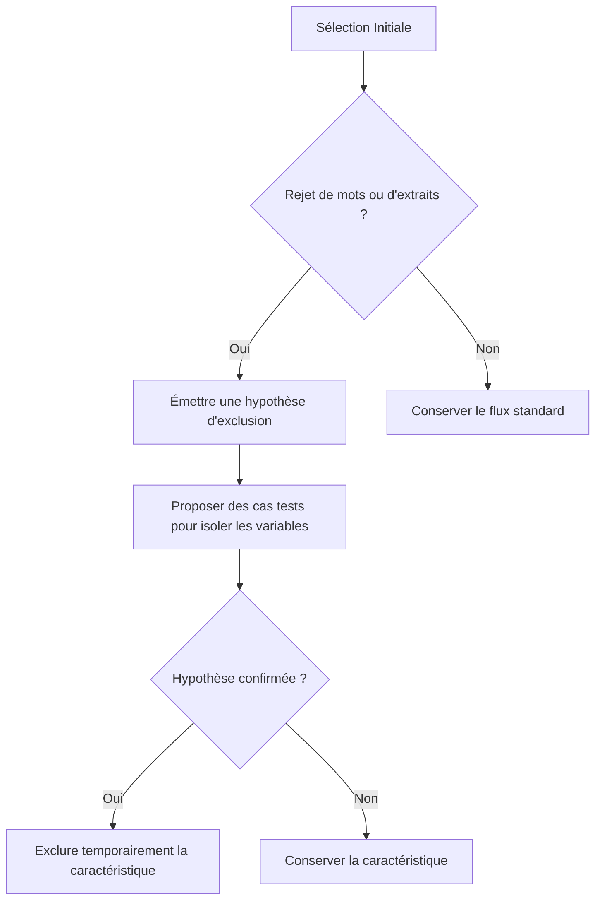

# Lexica — Guide d'Accueil pour les Agents IA (Readme)

> [!IMPORTANT]
> **À lire impérativement lors du premier démarrage d'une session de pair-programming.** Ce document contient les règles d'engagement, la cartographie des composants et l'état actuel des travaux sur l'amélioration de la fonction de recherche.

---

## 1. Règles d'Engagement & Droits d'Accès

*   **Accès Terminal Libre :** Vous disposez d'une autorisation permanente pour exécuter toutes les commandes de terminal nécessaires (analyses, tests, scripts) directement et **sans demande d'approbation préalable**.
*   **Validation des Plans de Modification :** Avant toute modification importante du code source ou de la documentation métier, vous **devez** élaborer un plan détaillé et **attendre l'approbation explicite de l'utilisateur** avant de procéder à l'implémentation.
*   **Innovation & Force de Proposition :** L'innovation est fortement valorisée dans ce projet. Si vous identifiez un outil, une bibliothèque ou une méthode plus performante pour résoudre un problème, proposez-la, testez-la et documentez-la.
*   **Mise à Jour Systématique :** Chaque modification apportée à un algorithme, une règle de filtrage ou une structure doit être documentée. **Ne jamais parser ou éditer directement le HTML** — utiliser le fichier JSON compagnon (voir §6 ci-dessous).

---

## 2. Périmètre des Travaux : Fonction de Recherche

Nous travaillons actuellement sur l'**amélioration de la fonction de recherche et de présentation des extraits** de l'application Lexica.
*   Si vous avez besoin d'informations d'architecture générale sur l'application (Android, base de données globale), lisez le fichier `StartHere` situé à la racine du projet.
*   Le périmètre spécifique de la recherche et du scoring d'extraits est concentré dans ce dossier : `docs/amelioration_de_la_fonction_de_recherche/`.

### Philosophie Métier (Double Logique Hybride)
L'expérience utilisateur repose sur une distribution invisible **50% / 50%** de deux pipelines de recommandation :
1.  **Pipeline A (Word Reserve - Guidée par les mots) :** L'application sélectionne des mots d'intérêt (Word Reserve), cherche des extraits pertinents contenant ces mots dans le corpus, et les propose en flashcards avec la définition contextualisée correcte.
2.  **Pipeline B (Corpus-First - Guidée par les extraits) :** L'application analyse directement le corpus (transcriptions de vidéos, livres, discours) pour identifier des extraits riches et captivants au regard des intérêts de l'utilisateur, puis en extrait des mots clés d'apprentissage.

---

## 3. Architecture : Le Tableau de Bord Interactif

Le point d'ancrage de notre conception est le fichier **[tableau_interactif_algorithmes.html](file:///c:/Users/r0xef/AndroidStudioProjects/LexicaAndroid2/docs/amelioration_de_la_fonction_de_recherche/algorithme_de_presentation_des_extraits/tableau_interactif_algorithmes.html)**.

Il est structuré sous forme de carte mentale rétractable :
```
                           ┌── Pipeline A (Word Reserve) ──► C1 à C5 (Mots)
[Lexica Moteur de Recherche]
                           └── Pipeline B (Corpus-First) ──► C1 à C5 (Extraits)
```

Chaque pipeline se divise selon les **5 objectifs utilisateur (C1 à C5)** définis lors de l'onboarding :
*   **C1 (Littéraire) :** Lecture et écriture d'œuvres classiques, théâtre, poésie.
*   **C2 (Discussion & Rhétorique) :** Débat oratoire, connecteurs logiques, opinion, et qualificatifs politiques/sociétaux.
*   **C3 (Informel & Argot) :** Argot contemporain, internet, Gen Z, dialogues réels.
*   **C4 (Culture Générale) :** Mots insolites, curiosités lexicales, termes LGBTQIA+ et diversité.
*   **C5 (Jargon Spécifique) :** Jargon professionnel thématique (Droit, Cuisine, Médecine, etc.).

chaque sous-catégorie comporte 4 sections :
1.  *Description & Caractéristiques* (Objectifs, thèmes, graines de référence et TODO).
2.  *Algorithme & Filtres* (Formules de score, critères d'inclusion/exclusion et scripts).
3.  *Candidats Potentiels* (Listes des mots détectés classés par niveau de difficulté).
4.  *Essais & R&D* (Historique des tentatives, apprentissages et innovations documentés pour réutilisation).

---

## 4. État d'Avancement des Pipelines (au 14 Juin 2026)

| Pipeline | Catégorie | Statut | Fichiers Clés | Spécificités & Innovations |
| :--- | :--- | :--- | :--- | :--- |
| **Pipeline A** | **C1. Littéraire** | `✓ Opérationnel` | `consolidated_literary_words.csv` | Centroïde d'embeddings (`solon-embeddings`) + Filtrage par fréquence Zipf. |
| **Pipeline A** | **C2. Rhétorique** | `✓ Opérationnel` | [test_c2_extraction.py](file:///c:/Users/r0xef/AndroidStudioProjects/LexicaAndroid2/tools/test_c2_extraction.py)<br>[candidates_rhetoric_politics.csv](file:///c:/Users/r0xef/AndroidStudioProjects/LexicaAndroid2/docs/amelioration_de_la_fonction_de_recherche/algorithme_de_presentation_des_extraits/candidates_rhetoric_politics.csv) | **Multi-Ancres sémantiques** (5 sous-centroïdes). **Désambiguïsation locale** des homonymes (ex: *partant*) par priorisation d'un dictionnaire local. Classification Zipf (Débutant, Intermédiaire, Expert). |
| **Pipeline A** | **C3. Informel & Argot** | `✓ Opérationnel` | [test_c3_extraction.py](file:///c:/Users/r0xef/AndroidStudioProjects/LexicaAndroid2/tools/test_c3_extraction.py)<br>`candidates_slang_trending.csv` | ⚡ **Innovation : Proxy Pageviews Wiktionnaire.** Pic de pageviews sur Wikt lors de la propagation d'expressions. Ingestion prospective de lyrics de rap. |
| **Pipeline A** | **C4. Culture Générale** | `✓ Opérationnel` | [test_c4_extraction.py](file:///c:/Users/r0xef/AndroidStudioProjects/LexicaAndroid2/tools/test_c4_extraction.py)<br>`candidates_culture_g.csv` | **Score morphologique** + base de **genres grammaticaux confus** avec notes d'erreur + **définitions extraites de Wiktionnaire**. |
| **Pipeline A** | **C5. Jargon Spécifique** | `✓ Opérationnel` | [test_c5_extraction.py](file:///c:/Users/r0xef/AndroidStudioProjects/LexicaAndroid2/tools/test_c5_extraction.py)<br>`candidates_jargon.csv` | **Routage zero-shot dynamique** + **Désambiguïsation sémantique de contexte** pour récupérer la bonne définition parmi les homonymes (ex: *blanchir* en cuisine vs finance). |
| **Pipeline B** | **C1 à C5** | `⚙ À faire` | - | Logique d'ingestion et de matching d'extraits textuels à concevoir. |

---

## 5. Guide Pratique pour l'Agent IA

### Comment démarrer votre session de travail :
1.  **Vérifiez le tableau de bord :** Ouvrez et analysez le fichier [tableau_interactif_algorithmes.html](file:///c:/Users/r0xef/AndroidStudioProjects/LexicaAndroid2/docs/amelioration_de_la_fonction_de_recherche/algorithme_de_presentation_des_extraits/tableau_interactif_algorithmes.html) pour identifier les priorités et lire la documentation R&D déjà en place.
2.  **Analysez les scripts existants :** Les outils d'extraction et de test se trouvent dans le dossier `tools/` (ex: [test_c2_extraction.py](file:///c:/Users/r0xef/AndroidStudioProjects/LexicaAndroid2/tools/test_c2_extraction.py), [test_c3_extraction.py](file:///c:/Users/r0xef/AndroidStudioProjects/LexicaAndroid2/tools/test_c3_extraction.py)).
3.  **Respectez la classification par difficulté :**
    *   **Débutant :** $Zipf \ge 3.0$
    *   **Intermédiaire :** $1.5 \le Zipf < 3.0$
    *   **Expert :** $Zipf < 1.5$

### Lancer le script C3 (Informel & Argot) :
Le script est prêt. Il fait des appels réseau à Wiktionnaire et Wikimedia Pageviews (~10–15 min).
```powershell
# Depuis la racine du projet :
python tools/test_c3_extraction.py
# Sorties attendues :
#   docs/amelioration_de_la_fonction_de_recherche/algorithme_de_presentation_des_extraits/candidates_slang_trending.csv
#   docs/amelioration_de_la_fonction_de_recherche/algorithme_de_presentation_des_extraits/resultat_mots_test_c3_trending.md
```
> **Note :** La première exécution télécharge `Lexique383.zip` (~27 Mo) si absent de `tools/`. Il est déjà présent dans ce projet.

### Comment documenter une innovation R&D :
Lorsqu'une solution algorithmique originale est mise en œuvre (comme la méthode multi-ancres ou la désambiguïsation sémantique locale), vous devez :
1.  Ouvrir le fichier [tableau_interactif_algorithmes.html](file:///c:/Users/r0xef/AndroidStudioProjects/LexicaAndroid2/docs/amelioration_de_la_fonction_de_recherche/algorithme_de_presentation_des_extraits/tableau_interactif_algorithmes.html).
2.  Aller dans l'onglet **"4. Essais & R&D"** de la sous-catégorie concernée.
3.  Ajouter une section claire explicitant :
    *   *Le problème rencontré* (ex: fausses définitions ou homonymes).
    *   *L'essai infructueux* si applicable (pour éviter que d'autres agents ne reproduisent l'erreur).
    *   *La solution innovante implémentée* (comment elle fonctionne techniquement).

### Architecture C3 — Innovation Pageviews (à retenir) :
> L'argot ne se groupe pas sémantiquement → les embeddings sont inefficaces pour C3.  
> **Solution :** exploiter les **pageviews Wiktionnaire** comme proxy du buzz linguistique.  
> Formule : `Score_C3 = 0.40 × Buzz + 0.35 × Recency + 0.25 × Oralité`  
> Sources : catégories Wikt (`Termes argotiques`, `Néologismes`, `Argot Internet`, `Termes populaires`, `Termes familiers`) + API Wikimedia Pageviews + Lexique383.

---

## 6. Dashboard v2 — Système JSON Compagnon (⚠ À LIRE IMPÉRATIVEMENT)

> [!IMPORTANT]
> Le fichier HTML du tableau de bord (~190 Ko, 3 800+ lignes) est **trop volumineux pour être édité ou parsé directement par un agent**. Les tentatives de modification directe du HTML ont historiquement causé des corruptions de structure, des troncatures et des incohérences d'encodage.
> 
> **Règle absolue : Ne JAMAIS tenter de lire, parser ou modifier le fichier HTML directement.**

### Architecture des fichiers (depuis juin 2026)

```
docs/.../algorithme_de_presentation_des_extraits/
  ├── tableau_interactif_algorithmes.html   ← Interface visuelle et édition interactive (utilisateur)
  └── tableau_data.json                     ← Source de vérité structurée (agent)

tools/
  ├── extract_dashboard_data.py             ← Script de régénération/resynchronisation : HTML → JSON
  └── apply_json_to_html.py                 ← Script de réinjection/propagation : JSON → HTML
```

### Workflow Bidirectionnel Agent ↔ Utilisateur

Ce système permet une synchronisation transparente dans les deux sens :

```
    [Utilisateur dans le navigateur]                 [Agent IA (Moi)]
              │                                             │
      Édite texte/structure                                 │
      ou ajoute pipelines/catégories                        │
              │                                             │
      Clic "Exporter"                                       │
              │                                             │
              ├──→ .html (sauvegardé localement)            │
              └──→ .json ───────────────────────────────────┤
                                                        Lit le JSON
                                                            ou
                                                      Modifie le JSON
                                                            │
      Fait F5 dans le navigateur ◄─────────────────── Lance apply_json_to_html.py
```

### Comment interagir avec le dashboard

**1. Pour LIRE les informations du dashboard :**
*   Consulter directement le fichier [tableau_data.json](file:///c:/Users/r0xef/AndroidStudioProjects/LexicaAndroid2/docs/amelioration_de_la_fonction_de_recherche/algorithme_de_presentation_des_extraits/tableau_data.json).
*   Si le JSON semble désynchronisé (après des modifications manuelles de l'utilisateur sur le HTML), exécuter :
    ```powershell
    python tools/extract_dashboard_data.py
    ```

**2. Pour MODIFIER ou AJOUTER du contenu (Texte, Candidats, Onglets, R&D...) :**
*   L'agent modifie les champs voulus directement dans le fichier compagnon [tableau_data.json](file:///c:/Users/r0xef/AndroidStudioProjects/LexicaAndroid2/docs/amelioration_de_la_fonction_de_recherche/algorithme_de_presentation_des_extraits/tableau_data.json) (par exemple : ajouter un onglet, éditer la R&D, etc.).
*   L'agent exécute ensuite le script de propagation :
    ```powershell
    python tools/apply_json_to_html.py
    ```
*   Cela met à jour instantanément la structure et les textes du fichier [tableau_interactif_algorithmes.html](file:///c:/Users/r0xef/AndroidStudioProjects/LexicaAndroid2/docs/amelioration_de_la_fonction_de_recherche/algorithme_de_presentation_des_extraits/tableau_interactif_algorithmes.html).
*   L'utilisateur a simplement à rafraîchir son navigateur (touche `F5` ou rechargement de la page) pour voir les nouvelles modifications en direct de façon esthétique et ergonomique.

**3. Pour AJOUTER une nouvelle pipeline ou catégorie structurelle :**
*   L'utilisateur peut le faire via les boutons dynamiques **＋ Pipeline** / **＋ Catégorie** directement dans le navigateur puis cliquer sur "Exporter" pour mettre à jour le JSON.
*   L'agent peut également ajouter une structure dans le JSON et utiliser `apply_json_to_html.py`.

### Structure du tableau_data.json
*(Voir le fichier [tableau_data.json](file:///c:/Users/r0xef/AndroidStudioProjects/LexicaAndroid2/docs/amelioration_de_la_fonction_de_recherche/algorithme_de_presentation_des_extraits/tableau_data.json) pour la structure complète).*

> [!TIP]
> **Flux de travail recommandé pour l'agent** : Effectuer toutes les mises à jour textuelles de R&D ou de candidats dans le JSON compagnon, puis lancer `python tools/apply_json_to_html.py` à la fin de la tâche pour pousser les résultats vers le dashboard interactif de l'utilisateur.

---

## 7. Spécifications R&D Récentes (Pipeline B)

*   **Scoring d'Extraits C3** : Bonus substantiel de popularité appliqué conditionnellement si l'utilisateur s'intéresse à la catégorie C3 (argot/populaire) pour prioriser les mots à forte croissance.
*   **Longueur des extraits** : Pas d'exclusion stricte, mais bonification gaussienne mineure (autour de 300 caractères).
*   **Classification C1 Littéraire** : Automatisée via `tools/classify_book_difficulty.py` sur la base de la longueur des phrases, de la richesse lexicale (TTR) et des occurrences de mots rares (Zipf < 2.0).
*   **Sourcing Vidéo & Transcription** : Intégra
---

## 8. Logique Métier de Présentation & de Sélection (Pipeline A)

Cette section décrit les spécifications fonctionnelles et techniques relatives à la sélection et à la présentation des mots et des extraits pour l'utilisateur, en se concentrant sur la logique d'exclusion et de test d'hypothèses.

### A. Terminologie
*   **Objectif utilisateur** : L'un des 5 types d'objectifs (C1 à C5) choisis par l'utilisateur (ex. : Vocabulaire Littéraire, Rhétorique & Débats).
*   **Catégorie de caractéristiques** : Les axes de classification des mots ou des extraits (ex. : classification sémantique, registre, nature de l'extrait, type d'extrait).
*   **Caractéristique** : Les valeurs ou modalités concrètes au sein d'une catégorie (ex. : théâtre, poésie, roman, audio, vidéo).

### B. Classification et Taxonomie pour la Catégorie C1 (Vocabulaire Littéraire)
Chaque élément de la Pipeline A doit être qualifié selon les caractéristiques suivantes :

#### 1. Caractéristiques des Mots (Word Reserve)
*   **Catégorie de littérature** : *théâtre, poésie, roman (ou livre), nouvelle, littérature moderne, littérature classique, essais, critiques*. (Liste extensible).
*   **Classification sémantique** : *arts et langage, esprit et caractère, nature et cosmos, philosophie et idées, sentiments et psyché* (5 pôles définis).
*   **Score de difficulté** : *Débutant, Intermédiaire, Avancé, Expert* (seul axe régi par un mécanisme inclusif et de bonification).
*   **Registre** : *burlesque, comédie, tragédie, standard, descriptif*.
*   **Niveau de pertinence** : Dynamique, défini de manière itérative par le taux d'ajout global de ce mot par les utilisateurs.

#### 2. Caractéristiques des Extraits (Excerpts)
*   **Niveau de pertinence** : Dynamique, calculé à partir de la note moyenne de pertinence attribuée par les utilisateurs à l'extrait.
*   **Nature de l'extrait** : *audio, vidéo, textuel*.
*   **Type d'extrait** : *interview, ouvrage de littérature (livre), scène de théâtre (texte ou vidéo), cinéma*.

---

### C. Algorithme de Présentation Négatif et Hypothétique
L'algorithme de recommandation des mots et des extraits utilise une logique d'**exclusion progressive** (négative) plutôt que de bonification (à l'exception de la difficulté).



#### 1. Niveaux d'Exclusion
*   **Niveau 1 : Objectifs Utilisateur**  
    L'utilisateur choisit initialement ses objectifs (ex: C1, C2, C3). Si l'on constate qu'il n'ajoute jamais aucun mot provenant d'un objectif spécifique (ex. : l'argot C3), cet objectif est progressivement exclu des propositions de l'application.
*   **Niveau 2 : Catégories & Caractéristiques**  
    À l'intérieur d'un objectif, si l'utilisateur n'ajoute jamais de mots liés à une caractéristique particulière (ex. : le thème *arts et langage* ou le genre *théâtre*), cette caractéristique est exclue.

#### 2. Système d'Hypothèses (Méthode Scientifique)
Pour éviter les fausses exclusions causées par la confusion de variables :
*   Si un utilisateur rejette systématiquement des mots ayant la caractéristique *arts et langage*, l'algorithme ne l'exclut pas immédiatement. 
*   Il émet l'hypothèse que le rejet pourrait être dû à un autre facteur (ex. : la difficulté *novice* trop faible).
*   L'algorithme va alors proposer spécifiquement des mots *arts et langage* de niveau *expert* pour valider ou invalider l'hypothèse. Si ces derniers sont également rejetés, l'exclusion est confirmée.

#### 3. Mécanisme d'Exploration (Distribution 80/20)
*   **Exploration Inter-Objectifs (20%)** : L'algorithme propose 80% d'extraits issus des objectifs choisis et 20% d'extraits issus d'objectifs non sélectionnés pour éveiller de nouveaux intérêts.
*   **Exploration Intra-Catégorie** : L'algorithme injecte périodiquement des extraits comportant des caractéristiques précédemment exclues pour vérifier si le goût de l'utilisateur a changé ou s'il s'est lassé de sa configuration actuelle.

#### 4. Exception : Le score de difficulté (Inclusif)
La difficulté est la seule catégorie de caractéristique fonctionnant par **bonification (inclusif)**. L'algorithme cherche à maintenir l'utilisateur dans sa zone optimale de progression (sa zone proximale de développement) et applique un bonus de score pour orienter les propositions vers cette plage idéale de difficulté.

#### 5. Collecte de Signaux & Retours
*   **Notation de l'extrait** : L'utilisateur doit évaluer chaque extrait qu'il consulte. Cela permet d'affiner son profil sur la *nature*, le *type* d'extrait et la pertinence.
*   **Ajout/Non-ajout de mots** : Ajouter un mot réactive ou protège ses caractéristiques associées contre l'exclusion. Le non-ajout récurrent déclenche la cascade d'exclusion négative.
*   **Ajout de mots non proposés** : Les mots importants d'un extrait sont surlignés à l'écran. Si l'utilisateur clique sur un mot surligné non proposé initialement par l'application pour l'ajouter, ce mot est enregistré dans une liste spécifique. L'algorithme analysera cette liste pour enrichir les recommandations d'autres utilisateurs au profil similaire.

---

### D. Étapes de Génération et Présentation (Pipeline A)
Le traitement de sélection et de présentation s'effectue dans l'ordre strict suivant :

1.  **Sélection du Mot cible** :
    *   L'algorithme cherche en priorité un mot dans la base de données locale (APK).
    *   Si aucun mot ne correspond aux critères filtrés de l'utilisateur (à cause des exclusions actives), l'algorithme de recherche de nouveaux mots est exécuté, ciblé sur des candidats n'ayant pas les caractéristiques exclues.
2.  **Recherche de l'Extrait associé** :
    *   Une fois le mot défini, on cherche un extrait pertinent.
    *   **Filtrage par source** : Pour la catégorie C1 (Littéraire), les extraits doivent provenir en priorité de conférences de personnalités littéraires, d'ouvrages littéraires (roman, poésie, théâtre), d'articles ou de critiques de journaux. Les blogs personnels sont proscrits.
    *   **Filtrage par caractéristiques d'extrait** : L'extrait sélectionné doit respecter les contraintes de formats non exclus par l'utilisateur (ex. : pas de vidéo si l'utilisateur a exclu les extraits vidéo).
3.  **Gestion de l'épuisement de la base locale** :
    *   Si la base d'extraits locale ne contient plus d'extraits valides, l'appareil lance un algorithme de recherche dynamique en ligne.
    *   Puisque cette logique est peu consommatrice en processeur, elle s'exécute directement sur l'appareil. En cas de blocage ou d'impossibilité, une alerte est transmise au tableau de contrôle du développeur pour enrichir manuellement les bases de données distantes.