# Matrice de Génération & Stratégies d'Extraits par Profil Utilisateur

Ce document sert de guide maître pour associer les choix de l'utilisateur (objectifs, niveau, thèmes) aux meilleures stratégies d'acquisition et de sélection de textes pour la **Pipeline A** (Word Reserve) et la **Pipeline B** (Découverte Spontanée).

> [!TIP]
> **Version Tableur (Excel / LibreOffice Calc)** :
> Tu peux ouvrir et manipuler cette matrice directement sous forme de tableur en double-cliquant sur ce fichier généré :
> **[matrice_strategies_generation.csv](file:///c:/Users/r0xef/AndroidStudioProjects/LexicaAndroid2/docs/amelioration_de_la_fonction_de_recherche/algorithme_de_presentation_des_extraits/matrice_strategies_generation.csv)** (séparateur `;` adapté aux tableurs en français).

## Carte Mentale des Stratégies de Sourcing

```mermaid
graph TD
  %% Style général
  classDef default fill:#f9f9f9,stroke:#333,stroke-width:1px;
  classDef c1 fill:#e1f5fe,stroke:#0288d1,stroke-width:2px;
  classDef c2 fill:#efebe9,stroke:#5d4037,stroke-width:2px;
  classDef c3 fill:#e8f5e9,stroke:#2e7d32,stroke-width:2px;
  classDef c4 fill:#fff3e0,stroke:#f57c00,stroke-width:2px;
  classDef c5 fill:#f3e5f5,stroke:#7b1fa2,stroke-width:2px;

  UserChoice["Choix de l'utilisateur (Onboarding)"] --> Objective1["C1. Littéraire"]:::c1
  UserChoice --> Objective2["C2. Rhétorique"]:::c2
  UserChoice --> Objective3["C3. Informel/Argot"]:::c3
  UserChoice --> Objective4["C4. Culture Générale"]:::c4
  UserChoice --> Objective5["C5. Domaine Spécifique"]:::c5

  %% Littéraire Subdivisions
  Objective1 --> L1["Niveau Débutant / Intermédiaire"]:::c1 --> OutL1["Jules Verne, Maupassant, Dumas<br>(Phrases courtes & récits fluides)"]
  Objective1 --> L2["Niveau Avancé"]:::c1 --> OutL2["Hugo, Zola, Flaubert, Baudelaire<br>(Phrases moyennes, figures de style)"]
  Objective1 --> L3["Niveau Expert"]:::c1 --> OutL3["Proust, Chateaubriand, Rimbaud, Montaigne<br>(Phrases longues & tournures complexes)"]

  %% Littéraire Croisés
  Objective1 --> CrossC2["+ C2. Rhétorique"]:::c2 --> OutCrossC2["Descartes, Rousseau, Diderot, Montesquieu<br>(Littérature d'idées, essais, théâtre classique)"]
  Objective1 --> CrossC3["+ C3. Informel"]:::c3 --> OutCrossC3["L.F. Céline, R. Queneau, Albert Camus<br>(Mélange de registres, écriture blanche)"]
  Objective1 --> CrossC4["+ C4. Culture G"]:::c4 --> OutCrossC4["Marguerite Yourcenar, Alexandre Dumas<br>(Romans historiques, récits de voyage)"]
  Objective1 --> CrossC5["+ C5. Domaine (K)"]:::c5 --> OutCrossC5["Balzac (Droit), Brillat-Savarin (Cuisine)<br>(Romans à corporations / documents spécialisés)"]

  %% Autres Objectifs
  Objective2 --> OutC2["Plaidoyers (Badinter, Jaurès), Discours, Essais<br>(Connecteurs logiques, argumentation)"]
  Objective3 --> OutC3["YouTube Transcripts (Squeezie, etc.), Twitter, OPUS<br>(Langage parlé contemporain Gen Z / Internet)"]
  Objective4 --> OutC4["Articles Wikipédia transversaux, Revues de vulgarisation<br>(Curiosités lexicales, variété sémantique)"]
  
  Objective5 --> DomAcad["Académique (Droit, Médecine...)"]:::c5 --> OutAcad["Résumés d'articles HAL, manuels universitaires"]
  Objective5 --> DomPrat["Pratique (Cuisine, Couture...)"]:::c5 --> OutPrat["Wikibooks pratiques, blogs spécialisés, tutos"]
```

---

## 1. Tableau Général des Stratégies (Matrice de Routage)

| Profil Dominant | Objectif Secondaire | Niveau (Zipf) | Domaine Spécifique ($K$) | Sourcing Pipeline A (Sélection Mots) | Sourcing Pipeline B (Livres & Textes Recommandés) |
| :--- | :--- | :--- | :--- | :--- | :--- |
| **C1. Littéraire** | Aucun | Débutant / Intermédiaire (Zipf $\ge 3.0$) | Aucun | Mots littéraires courants (Lexique.org ratio) | Jules Verne, Maupassant, A. Dumas, St-Exupéry (Syntaxe claire, récits fluides). |
| **C1. Littéraire** | Aucun | Avancé (Zipf $[1.5, 3.0]$) | Aucun | Mots littéraires rares / figures de style | Victor Hugo, Émile Zola, Gustave Flaubert, Baudelaire (Vocabulaire riche, métaphores). |
| **C1. Littéraire** | Aucun | Expert (Zipf $< 1.5$) | Aucun | Archaïsmes élégants, mots rares complexes | Marcel Proust, Chateaubriand, Mallarmé, Rimbaud, Montaigne (Phrases longues, tournures complexes). |
| **C1. Littéraire** | **C2. Rhétorique** | Tous | Aucun | Mots à forte abstraction conceptuelle | Descartes, Rousseau, Diderot, Montesquieu, Essais politiques d'Hugo ou Zola. |
| **C1. Littéraire** | **C3. Informel** | Tous | Aucun | Néologismes d'auteur, registres mêlés | L.F. Céline, Raymond Queneau, Albert Camus (*L'Étranger*), Littérature contemporaine (ex: Despentes). |
| **C1. Littéraire** | **C4. Culture Générale**| Tous | Aucun | Curiosités littéraires, mots historiques | Romans historiques (Alexandre Dumas, Marguerite Yourcenar), Récits de voyage classiques (Chateaubriand). |
| **C1. Littéraire** | **C5. Domaine Spécifique**| Tous | **Cuisine / Art Culinaire** | Vocabulaire culinaire soutenu | Brillat-Savarin (*Physiologie du goût*), A. Dumas (*Grand Dictionnaire de cuisine*). |
| **C1. Littéraire** | **C5. Domaine Spécifique**| Tous | **Droit / Justice** | Vocabulaire juridique littéraire | Balzac (*La Comédie Humaine* - trames notariales), Hugo (*Les Misérables* - procès). |
| **C2. Rhétorique** | Aucun | Tous | Aucun | Connecteurs logiques, verbes d'opinion précis | Discours politiques historiques, plaidoyers (Badinter, Jaurès), essais argumentatifs. |
| **C3. Informel** | Aucun | Tous | Aucun | Argot moderne, verlan, néologismes | Transcriptions YouTube (Squeezie, etc.), Tweets récents, dialogues de films contemporains (OPUS). |
| **C4. Culture Générale**| Aucun | Tous | Aucun | Mots insolites, curiosités lexicales | Articles Wikipédia transversaux (Art, Histoire, Sciences), revues de vulgarisation scientifique. |
| **C5. Domaine Spécifique**| Aucun | Tous | Académique (ex: Droit, Médecine) | Jargon technique ciblé | Résumés d'articles HAL, manuels d'introduction universitaire, Wikipédia scientifique. |
| **C5. Domaine Spécifique**| Aucun | Tous | Pratique (ex: Cuisine, Couture) | Termes techniques d'atelier/recettes | Wikibooks pratiques, blogs spécialisés, transcriptions de tutoriels vidéo. |

---

## 2. Focus Étape par Étape : Catégorie 1 - Vocabulaire Littéraire (C1)

Nous détaillons ici les critères d'ajustement pour affiner la **Pipeline B** (choix des extraits) et la **Pipeline A** spécifiquement pour les utilisateurs ayant choisi l'objectif **C1. Littéraire**.

### A. Filtrage par Niveau Littéraire (Complexité Syntaxique & Vocabulaire)
La classification par niveau ne se limite pas à la rareté d'un mot isolé, elle doit aussi refléter la **difficulté de la phrase** dans laquelle il est inséré.

#### 1. Niveau Débutant / Intermédiaire
*   **Objectif** : Enrichir le vocabulaire sans décourager par des structures de phrases trop lourdes.
*   **Sélection de livres (Pipeline B)** :
    *   *Jules Verne* (*Vingt mille lieues sous les mers*, *Le Tour du monde en quatre-vingts jours*) : Vocabulaire technique et aventureux, mais syntaxe linéaire.
    *   *Guy de Maupassant* (Nouvelles, *Bel-Ami*) : Style épuré, réaliste, phrases courtes et directes.
    *   *Alexandre Dumas* (*Les Trois Mousquetaires*) : Dialogues vivants, récits d'action fluides.
*   **Critère de filtrage de l'extrait** : 
    *   Longueur max de la phrase : 25 mots.
    *   Exclusion des phrases avec plus d'une proposition subordonnée relative.

#### 2. Niveau Avancé
*   **Objectif** : Introduire des figures de style, de belles métaphores, et des structures de phrases plus élaborées.
*   **Sélection de livres (Pipeline B)** :
    *   *Victor Hugo* (*Notre-Dame de Paris*, *Les Travailleurs de la mer*) : Style grandiose, descriptions riches.
    *   *Gustave Flaubert* (*Madame Bovary*, *L'Éducation sentimentale*) : Précision du mot juste, travail rythmique de la phrase.
    *   *Émile Zola* (*Germinal*, *L'Assommoir*) : Naturalisme, vocabulaire des métiers et des milieux sociaux, descriptions denses.
*   **Critère de filtrage de l'extrait** :
    *   Phrases de longueur moyenne (15 à 40 mots).
    *   Présence de figures de style identifiées morphologiquement (comparaisons avec "comme", adjectifs antéposés).

#### 3. Niveau Expert
*   **Objectif** : Confronter l'utilisateur à la virtuosité stylistique française, aux structures de phrases complexes (phrases proustiennes), et à un vocabulaire très soutenu ou archaïque.
*   **Sélection de livres (Pipeline B)** :
    *   *Marcel Proust* (*À la recherche du temps perdu*) : Subordonnées imbriquées, incises temporelles, style analytique.
    *   *François-René de Chateaubriand* (*Mémoires d'outre-tombe*) : Style noble, vocabulaire très recherché.
    *   *Textes classiques anciens (XVIe-XVIIe)* : Montaigne (*Essais*), Saint-Simon (*Mémoires*).
*   **Critère de filtrage de l'extrait** :
    *   Phrases longues (jusqu'à 60-80 mots).
    *   Tolérance pour les inversions sujet-verbe complexes et l'usage du subjonctif imparfait.

---

### B. Combinaison avec d'autres Objectifs (Ajustement Croisé)

Si l'utilisateur coche **Littéraire (C1)** ET un autre objectif, le script ajuste dynamiquement le sous-ensemble d'ouvrages ciblés dans la base de données :

#### 1. Littéraire (C1) + Rhétorique (C2)
*   **Raisonnement** : L'utilisateur veut écrire de la littérature d'idées ou argumenter de façon soutenue.
*   **Livres cibles** :
    *   Les Essais philosophiques classiques : Jean-Jacques Rousseau (*Du contrat social*, *Émile*), Denis Diderot.
    *   Le théâtre classique axé sur le dilemme et le débat : Corneille (*Le Cid*), Racine.
    *   Les préfaces engagées : Les préfaces de Victor Hugo (*Cromwell*, *Les Contemplations*).

#### 2. Littéraire (C1) + Informel (C3)
*   **Raisonnement** : L'utilisateur cherche le style littéraire moderne qui intègre l'oralité, l'argot d'époque, ou la rupture de registre.
*   **Livres cibles** :
    *   *Louis-Ferdinand Céline* (*Voyage au bout de la nuit*) : Révolution syntaxique, argot parisien mêlé à un style lyrique.
    *   *Raymond Queneau* (*Zazie dans le métro*) : Jeux de mots, transcription phonétique du langage populaire.
    *   *Albert Camus* (*L'Étranger*) : Style neutre ("écriture blanche"), phrases courtes et familières structurées littérairement.

#### 3. Littéraire (C1) + Culture Générale (C4)
*   **Raisonnement** : Intérêt pour les faits historiques, la mythologie, les pays lointains vus par les écrivains.
*   **Livres cibles** :
    *   Romans historiques : Alexandre Dumas (*Le Comte de Monte-Cristo*), Marguerite Yourcenar (*Mémoires d'Hadrien*).
    *   Récits de voyage littéraires : Chateaubriand (*Itinéraire de Paris à Jérusalem*), Gérard de Nerval (*Voyage en Orient*).

#### 4. Littéraire (C1) + Domaine Spécifique (C5) avec mot-clé $K$
*   **Raisonnement** : Recherche d'œuvres littéraires qui gravitent autour d'une corporation, d'un métier ou d'un univers spécifique.
*   **Stratégie de filtrage** :
    *   Si $K$ = **Droit/Justice** $\rightarrow$ Honoré de Balzac (très précis sur les successions, les avoués, les faillites dans *César Birotteau* ou *Illusions perdues*).
    *   Si $K$ = **Cuisine** $\rightarrow$ Brillat-Savarin (*Physiologie du goût*), Alexandre Dumas (*Grand Dictionnaire de cuisine*).
    *   Si $K$ = **Médecine** $\rightarrow$ Jules Romains (*Knock ou le Triomphe de la médecine*), Zola (*Le Docteur Pascal*).
