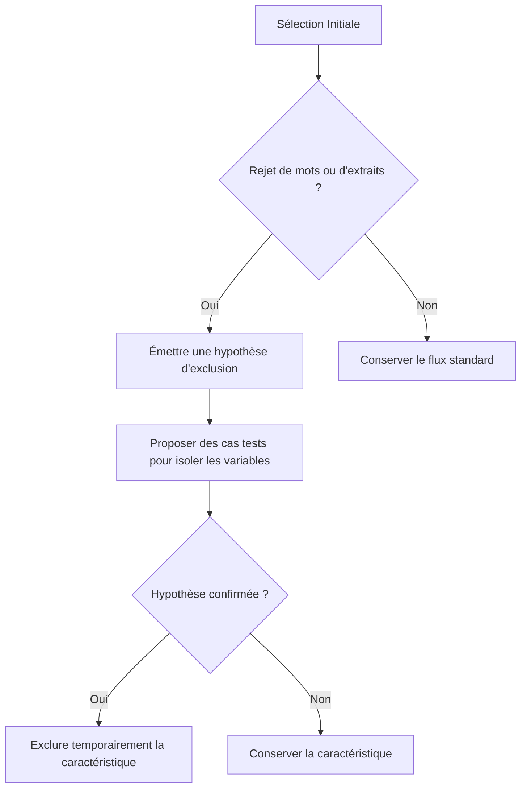

DATE IMPORTANTE ICI, LA DATE LA PLUS RECENTE PRIME, CE FICHIER N'EST PAS MIS A JOUR AU FUR ET A MESURE DE LA CONSTRUCTION MAIS REPRESENTE LETAT DE LA CONCEPTION DU PROJET A UN INSTANT T. CONSULTEZ LE HTML OU LE JSON 

## 1. Description précise de la logique métier 15-06-2026 (pipelin A uniquement)

Cette section décrit les spécifications fonctionnelles et techniques relatives à la sélection et à la présentation des mots et des extraits pour l'utilisateur, en se concentrant sur la logique d'exclusion et de test d'hypothèses.

### A. Terminologie
*   **Objectif utilisateur** : L'un des 5 types d'objectifs (C1 à C5) choisis par l'utilisateur (ex. : Vocabulaire Littéraire, Rhétorique & Débats).
*   **Catégorie de caractéristiques** : Les axes de classification des mots ou des extraits (ex. : classification sémantique, registre, nature de l'extrait, type d'extrait).
*   **Caractéristique** : Les valeurs ou modalités concrètes au sein d'une catégorie (ex. : théâtre, poésie, roman, audio, vidéo).

### B. Classification et Taxonomie pour la Catégorie C1 (Vocabulaire Littéraire)
Chaque élément de la Pipeline A doit être qualifié selon les caractéristiques suivantes :

#### 1. Caractéristiques des Mots (Word Reserve)
*   **Catégorie de littérature** : *théâtre, poésie, roman (ou livre), nouvelle, littérature moderne, littérature classique, essais, critiques*. (Liste extensible).
*   **Classification sémantique** : *arts et langage, esprit et caractère, nature et cosmos, philosophie et idées, sentiments et psyché* (5 pôles définis).
*   **Score de difficulté** : *Débutant, Intermédiaire, Avancé, Expert* (seul axe régi par un mécanisme inclusif et de bonification).
*   **Registre** : *burlesque, comédie, tragédie, standard, descriptif*.
*   **Niveau de pertinence** : Dynamique, défini de manière itérative par le taux d'ajout global de ce mot par les utilisateurs. exemple : 100 ajout sur 200 proposition pertinence = 50% (pertinence = nombre d'ajouts / nombre total de propositions). La pertinence commence à partir de 100 notations
*   **ID des mots** : chaque mot doit avoir un ID. centralisé entre tout les utilisateur les bases de données et moi

#### 2. Caractéristiques des Extraits (Excerpts)
*   **Niveau de pertinence** : Dynamique, calculé à partir de la note moyenne de pertinence attribuée par les utilisateurs à l'extrait. exemple : directement donné par la moyenne de score de l'extrait, note moyenne de 2.5/5 = pertinence = 50%. La pertinence commence à partir de 100 notations.
*   **Nature de l'extrait** : *audio, vidéo, textuel*.
*   **Type d'extrait** : *interview, ouvrage de littérature (livre), scène de théâtre (texte ou vidéo), cinéma*.
*   **ID des extraits** : chaque extrait doit avoir un ID pour permettre d'éviter de le presenter plusieurs fois s'il n'a pas à l'être. centralisé entre tout les utilisateur les bases de données et moi.
---

### C. Algorithme de Présentation Négatif et Hypothétique
L'algorithme de recommandation des mots et des extraits utilise une logique d'**exclusion progressive** (négative) plutôt que de bonification (à l'exception de la difficulté).

#### 1. Niveaux d'Exclusion
*   **Niveau 1 : Objectifs Utilisateur**  
    L'utilisateur choisit initialement ses objectifs (ex: C1, C2, C3). Si l'on constate qu'il n'ajoute jamais aucun mot provenant d'un objectif spécifique (ex. : l'argot C3), cet objectif est progressivement exclu des propositions de l'application.
*   **Niveau 2 : Catégories & Caractéristiques**  
    À l'intérieur d'un objectif, si l'utilisateur n'ajoute jamais de mots liés à une caractéristique particulière (ex. : le thème *arts et langage* ou le genre *théâtre*), cette caractéristique est exclue.

#### 2. Système d'Hypothèses (Méthode Scientifique)
Pour éviter les fausses exclusions causées par la confusion de variables :
*   Si un utilisateur rejette systématiquement des mots ayant la caractéristique *arts et langage*, l'algorithme ne l'exclut pas immédiatement. 
*   Il émet l'hypothèse que le rejet pourrait être dû à un autre facteur (ex. : la difficulté *novice* trop faible).
*   L'algorithme va alors proposer spécifiquement des mots *arts et langage* de niveau *expert* pour valider ou invalider l'hypothèse. Si ces derniers sont également rejetés, l'exclusion est confirmée.

#### 3. Mécanisme d'Exploration (Distribution 80/20)
*   **Exploration Inter-Objectifs (20%)** : L'algorithme propose 80% d'extraits issus des objectifs choisis et 20% d'extraits issus d'objectifs non sélectionnés pour éveiller de nouveaux intérêts.
*   **Exploration Intra-Catégorie** : L'algorithme injecte périodiquement des extraits comportant des caractéristiques précédemment exclues pour vérifier si le goût de l'utilisateur a changé ou s'il s'est lassé de sa configuration actuelle. lorsque des catégories commencerons à être exclu, si c'est le cas, alors les 20% d'exploration seront distribué entre exploration inter objectif et l'exploration intra catégorie.
* Si aucunes catégories ni aucuns objectifs ne sont exclu alors il n'y a pas d'exploration (logique)

#### 4. Exception : Le score de difficulté (Inclusif)
La difficulté est la seule catégorie de caractéristique fonctionnant par **bonification (inclusif)**. L'algorithme cherche à maintenir l'utilisateur dans sa zone optimale de progression (sa zone proximale de développement) et applique un bonus de score pour orienter les propositions vers cette plage idéale de difficulté. Il nous faut définir précisément la notion de difficultée, notamment en opérationnalisant la caractéristique d'abstraction des mots.

#### 5. Collecte de Signaux & Retours
*   **Notation de l'extrait** : L'utilisateur doit évaluer chaque extrait qu'il consulte. Cela permet d'affiner son profil sur la *nature*, le *type* d'extrait et la pertinence.
*   **Ajout/Non-ajout de mots** : Ajouter un mot réactive ou protège ses caractéristiques associées contre l'exclusion. Le non-ajout récurrent déclenche la cascade d'exclusion négative.
*   **Ajout de mots non proposés** : Les mots proposé (issu de la reserve de mots, l'extrait est construit à partir de ceux-ci) d'un extrait sont surlignés à l'écran. Si l'utilisateur clique sur un mot non surligné (et donc non proposé initialement par l'application) pour l'ajouter, ce mot est enregistré dans une liste spécifique. L'algorithme analysera cette liste pour enrichir les recommandations d'autres utilisateurs au profil similaire..
*   **présentation du même mots plusieurs fois** : la re présentation d'un mot non ajouté à la liste des mots de l'utilisateur est possible sous certaines conditions. 1. Pas sur une même session de recherche d'extrait, l'utilisateur doit avoir fermé  l'application au moins 1 fois. 2. L'extraits doit être différent (un extrait proposé n'est jamais représenté). 3. uniquement pour les mots de la data liste initial ou les mots ayant une pertinence supérieur à 50%.  4. jamais dans un cadre exploratoire. 

---

### D. Étapes de Génération et Présentation (Pipeline A) :
Le traitement de sélection et de présentation s'effectue dans l'ordre strict suivant :

1.  **Sélection du Mot cible** :
    *   L'algorithme cherche en priorité un mot dans la base de données locale (APK) répondant aux critères.
    *   Si aucun mot ne correspond aux critères filtrés de l'utilisateur (à cause des exclusions actives), l'algorithme de recherche de nouveaux mots est exécuté, ciblé sur des candidats n'ayant pas les caractéristiques exclues.
    *   Soit le mot possède déjà une définition dans la base de donnée, pertinente au regard de l'objectif utilisateur, soit n'est pas présente ou non pertinente (non pertinence peu probable et vérifiable au moyen du test emmbeddings contextuels). Ces deux possibilité auront une incidence sur l'étape 2. 

2.  **Recherche de l'Extrait associé** :
    *   Si le mot possède une définition pertinente (étape 1), on cherche un extrait pertinent, c'est à dire qui dans lequel l'utilisation du mot en question prend le sens qui nous interesse (embedding contextuel). 
    * si le mot ne possède pas de définition, l'extrait est cherché dans un dommaine pertinent au regard de l'objectif utilisateur (pour C1 ou cherche dans des ouvrages de références en littérature ) et la définition est déterminé en fonction de l'extrait, gràce au wiktionnaire. Un test embeddings contextuels permettra  de selectionner la bonne définition wiktionnaire, si aucunes défintions ne correspond, un modèle LLM est appelé pour générer une définition sur mesure.
    *   **Filtrage par source** : Pour la catégorie C1 (Littéraire), les extraits doivent provenir en priorité de conférences de personnalités littéraires, d'ouvrages littéraires (roman, poésie, théâtre), d'articles ou de critiques de journaux. Les blogs personnels sont proscrits.
    *   **Filtrage par caractéristiques d'extrait** : L'extrait sélectionné doit respecter les contraintes de formats non exclus par l'utilisateur (ex. : pas de vidéo si l'utilisateur a exclu les extraits vidéo).
    *   **création d'une flashcard pour l'entrainement** : un des objectifs principal de l'app est de permettre à l'utilisateur de permettre à l'utilisateur de s'entrainer grace à des flashcards, donc lorsqu'un mot est ajouté, la logique métier actuel (qu'utilise actuellement l'app)permettant la génération d'une flashcard doit se mettre en route
        
3.  **Gestion de l'épuisement de la base locale** :
    *   Si la base d'extraits locale ne contient plus d'extraits valides, l'appareil lance un algorithme de recherche dynamique en ligne.
    *   Puisque cette logique est peu consommatrice en processeur, elle s'exécute directement sur l'appareil. En cas de blocage ou d'impossibilité, une alerte est transmise au tableau de contrôle du développeur pour enrichir manuellement les bases de données distantes.

### E. reste à définire 
* définir précisément chaque caractéristique de chaque catégorie pour chaques objectif de manière exhaustive.
* définir l'algorytmhe exacte qui permettra une recherche de mots depuis le téléphone utilisateur si la base de donnée n'en contient pas répondant aux critères (caractéristiques exclue). et le tester pour chaques cas possible (chaques combinaisons de caractéristiques exclues dans chaques objectifs).
* définir l'algorytmhe exacte qui permettra une recherche d'extrait contenant le mot cibler si la base de donnée n'en contient pas répondant aux critères (caractéristiques exclues). et le tester pour chaques cas possible (chaques combinaisons de caractéristiques exclues dans chaques objectifs).
* définir la logique métier de la pipeline B. 
* opérationnaliser l'algorythme d'hypothèse exclusive. Et le tester en situation réels simulées.
* Il nous faut définir précisément la notion de difficultée, notamment en opérationnalisant la caractéristique d'abstraction des mots.
* Définir plus précisément comment on fait pour proposer des extraits vidéo ou audio...
* définir les sources relatives à chaques catégories de caractéristiques pour chaques objectifs.
* trouver un système pour permettre la purge du stockage local de l'utilisateur tout en s'assurant que les extraits déjà présenté et qui n'ont pas à être représenté ne le soit pas.
* voir comment on peut intégrer Desrochers aux algo.

### F. précision
* Lorsqu'un objectif, ou la caractéristique d'une catégorie est exclue, elle est directement investie du mode exploratoire qui distribue les 20% aux domaines exclues. L'utilisateur n'est pas notifié des exclusion ni d'aucuns des fonctionnements de la logique métier.
* En ce qui concerne la purge d'extrait et mots en local il faut un système 
* les Homographes non Homophones ont des définitions dfférentes et l'embeddings contextuel devrait pouvoir les reconnaïtre de plus il y en a peu dont plusieurs définitions pourraient être intéressante au regard de l'utilité de l'appli. On eut en faireune liste manuellement.
* L'app doit garder en mémoir le fait qu'elle a déjà proposé un extrait, ce qui évitera de proposer le mêmes extraits contenant plusieurs mots d'intéréts plusieurs fois.
* le système de notation coté UX sera continu : une ligne de plusieurs étoile (je sais pas encore le nombre exact)que l'utilisateur pourra faire défiler ce qui nous permettra d'avoir 2.742546xxx étoile sur 5 (par exempe).
* dans le cas d'une recherche "au jour le jour" de mots et d'extraits il faut toujours en avoir minimum 10 d'avance pour permettre à l'utilisateur de ne pas avoir de latence dans le cas par exemple de la nécessité d'un appel LLM. et en cas de latence trop forte penser à un écran de charcgement, ou envoyer des extraits qui ne respectent pas les critères ou contenant des mots qui ne respecte pas les critères (procédure d'urgences) si il n'y a pas le choix.

### G. petites infos supp qui ont potentiellement rien à voir mais que je met là pour pas oublier.
* depuis la page d'extraits l'utilisateur doit pouvoir ajouter un mot à ses favoris sans l'ajouter à sa liste de mots a travailler.
* envoyer la notif pour un mot par jour (le plus pertinent) 
* prioriser la reherche de mot au lancement de l'app avec petite page de chargement avec une citation (liste de citation à créer genre marcel pagnol qui collectionnait les mots. Ou la bilbe : au commencement était le verbe).
* petit cours de psychologie cognitive dans des infos supp qui explique pourquoi c'est la meilleur méthode d'apprentissage au regard de la littéraure scientifique.
* lecture de livre libre depuis une bibliothèque dans l'app ou visionnage de film depuis la filmothèque avec ajout de mot possible en appuyant dessus.
* refactory de l'entrainement en maximisant les "usages"
* tout les jours "focus sur un mot" : sélection d'un mot au hazard dans les favoris ou dans les mots à travailler, et défi spécifique : l'utiliser dans une conversation dans la journée, écrire une phrase avec...
* pouvoir prnedre nu text en photo et selectionner des mots à l'interieur pour les ajouter.
* dans les livres de la bibliothèque pouvoir soit les lires soit demander la création d'une liste de flascards ou la selection d'extraits spécifiquement dans le livre. donc parsage intégrale du livre et proposition de tout les extraits selectionné contenant des mots potentiellement interressant.
* potentiels pépites ; Pépite 1 : La Base Manulex (Lété, Sprenger-Charolles & Colé) ; Pépite 2 : Les Modèles HLR (Half-Life Regression) pour la répétition espacée (SRS) ;  Pépite 3 : Les Indices de Valence Émotionnelle et d'Arousal (Base FAN / Bonin et al.) ; 💡 Pépite 4 : Le Voisinage Orthographique (Voisinage de Coltheart & Distance de Levenshtein)

## 2. Au 18-06-2026 décision pour la V1.0 de Lexica
* Uniquement les objectifs 1 (vocabulaire littéraire) et 5 (jargon spécifique) sont à prendre en compte.